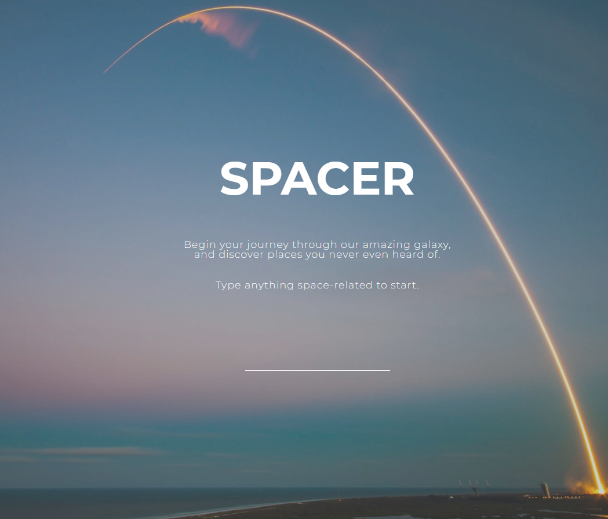

# spacer-app 🚀

This app uses [NASA image API](https://images.nasa.gov/docs/images.nasa.gov_api_docs.pdf) to fetch images and display them after passing search query.

Netlify - [Live!](https://spacer-app.netlify.com/)

## Project setup
```
npm install
```

### Compiles and hot-reloads for development
```
npm run serve
```

### Compiles and minifies for production
```
npm run build
```

### Run your tests
```
npm run test
```

### Technologies used

- HTML/HTML5,
- SASS,
- JavaScript/ES6,
- NASA API -> [NASA image API](https://images.nasa.gov/docs/images.nasa.gov_api_docs.pdf),
- Vue JS,
- Axios,
- Lodash.debounce,
- NPM Scripts

